# vowels

## cs

🔊: /a/

## cj

🔊: /i/

## j2

🔊: /u/

## sr

🔊: /ɔ/

## sh

🔊: /e/

## j3

🔊: /o/

## st

🔊: /ə/

## sy

🔊: /y/

## co

🔊: /ai/

## j6

🔊: /iu/

## sd

🔊: /ua/

## cd

🔊: /au/

## se

🔊: /ui/

## rh

🔊: /ia/

## fi

🔊: /io/

## j8

🔊: /oi/

# consonants

## 1l
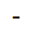

🔊: /m/

## 2l
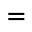

🔊: /k/

## 3l
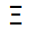

🔊: /j/

## j1
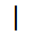

🔊: /p/

## cl
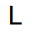

🔊: /w/

## ad
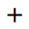

🔊: /n/

## tt
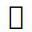

🔊: /t/

## ct
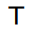

🔊: /l/

## uu
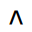

🔊: /s/

## dd
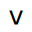

🔊: /b/

## ll
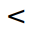

🔊: /g/

## rr
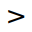

🔊: /h/

## cn
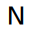

🔊: /d/

## cy
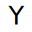

🔊: /r/

## ua

🔊: /f/

## 1x

🔊: /tʃ/
