# cs

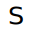

🔊 /a/

# cj

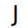

🔊 /i/

# j2

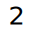

🔊 /u/

# sr

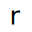

🔊 /ɔ/

# sh

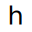

🔊 /o/

# j3

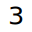

🔊 /ə/

# st

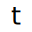

🔊 /e/

# sy

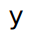

🔊 /y/

# co

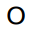

🔊 /ia/

# j6

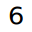

🔊 /iu/

# sd

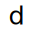

🔊 /ie/

# cd

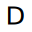

🔊 /ye/

# se

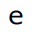

🔊 /ua/

# rh

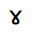

🔊 /ui/

# fi

🔊 /uo/

# j8

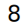

🔊 /ai/

# 1lcs

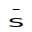

🔊 /ka/

# 1lcj

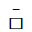

🔊 /ki/

# 1lj2

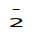

🔊 /ku/

# 1lsr

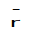

🔊 /kɔ/

# 1lsh

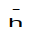

🔊 /ko/

# 1lj3

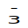

🔊 /kə/

# 1lst

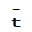

🔊 /ke/

# 1lsy

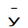

🔊 /ky/

# 1lco

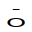

🔊 /kia/

# 1lj6

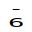

🔊 /kiu/

# 1lsd

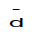

🔊 /kie/

# 1lcd

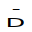

🔊 /kye/

# 1lse

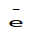

🔊 /kua/

# 1lrh

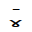

🔊 /kui/

# 1lfi

🔊 /kuo/

# 1lj8

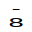

🔊 /kai/

# 2lcs

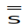

🔊 /ga/

# 2lcj

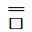

🔊 /gi/

# 2lj2

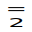

🔊 /gu/

# 2lsr

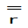

🔊 /gɔ/

# 2lsh

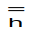

🔊 /go/

# 2lj3

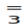

🔊 /gə/

# 2lst

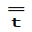

🔊 /ge/

# 2lsy

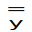

🔊 /gy/

# 2lco

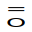

🔊 /gia/

# 2lj6

🔊 /giu/

# 2lsd

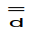

🔊 /gie/

# 2lcd

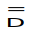

🔊 /gye/

# 2lse

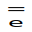

🔊 /gua/

# 2lrh

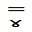

🔊 /gui/

# 2lfi

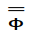

🔊 /guo/

# 2lj8

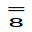

🔊 /gai/

# 3lcs

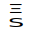

🔊 /pa/

# 3lcj

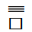

🔊 /pi/

# 3lj2

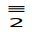

🔊 /pu/

# 3lsr

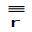

🔊 /pɔ/

# 3lsh

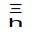

🔊 /po/

# 3lj3

🔊 /pə/

# 3lst

🔊 /pe/

# 3lsy

🔊 /py/

# 3lco

🔊 /pia/

# 3lj6

🔊 /piu/

# 3lsd

🔊 /pie/

# 3lcd

🔊 /pye/

# 3lse

🔊 /pua/

# 3lrh

🔊 /pui/

# 3lfi

🔊 /puo/

# 3lj8

🔊 /pai/

# j1cs

🔊 /ba/

# j1cj

🔊 /bi/

# j1j2

🔊 /bu/

# j1sr

🔊 /bɔ/

# j1sh

🔊 /bo/

# j1j3

🔊 /bə/

# j1st

🔊 /be/

# j1sy

🔊 /by/

# j1co

🔊 /bia/

# j1j6

🔊 /biu/

# j1sd

🔊 /bie/

# j1cd

🔊 /bye/

# j1se

🔊 /bua/

# j1rh

🔊 /bui/

# j1fi

🔊 /buo/

# j1j8

🔊 /bai/

# clcs

🔊 /ta/

# clcj

🔊 /ti/

# clj2

🔊 /tu/

# clsr

🔊 /tɔ/

# clsh

🔊 /to/

# clj3

🔊 /tə/

# clst

🔊 /te/

# clsy

🔊 /ty/

# clco

🔊 /tia/

# clj6

🔊 /tiu/

# clsd

🔊 /tie/

# clcd

🔊 /tye/

# clse

🔊 /tua/

# clrh

🔊 /tui/

# clfi

🔊 /tuo/

# clj8

🔊 /tai/

# adcs

🔊 /da/

# adcj

🔊 /di/

# adj2

🔊 /du/

# adsr

🔊 /dɔ/

# adsh

🔊 /do/

# adj3

🔊 /də/

# adst

🔊 /de/

# adsy

🔊 /dy/

# adco

🔊 /dia/

# adj6

🔊 /diu/

# adsd

🔊 /die/

# adcd

🔊 /dye/

# adse

🔊 /dua/

# adrh

🔊 /dui/

# adfi

🔊 /duo/

# adj8

🔊 /dai/

# ttcs

🔊 /ma/

# ttcj

🔊 /mi/

# ttj2

🔊 /mu/

# ttsr

🔊 /mɔ/

# ttsh

🔊 /mo/

# ttj3

🔊 /mə/

# ttst

🔊 /me/

# ttsy

🔊 /my/

# ttco

🔊 /mia/

# ttj6

🔊 /miu/

# ttsd

🔊 /mie/

# ttcd

🔊 /mye/

# ttse

🔊 /mua/

# ttrh

🔊 /mui/

# ttfi

🔊 /muo/

# ttj8

🔊 /mai/

# ctcs

🔊 /na/

# ctcj

🔊 /ni/

# ctj2

🔊 /nu/

# ctsr

🔊 /nɔ/

# ctsh

🔊 /no/

# ctj3

🔊 /nə/

# ctst

🔊 /ne/

# ctsy

🔊 /ny/

# ctco

🔊 /nia/

# ctj6

🔊 /niu/

# ctsd

🔊 /nie/

# ctcd

🔊 /nye/

# ctse

🔊 /nua/

# ctrh

🔊 /nui/

# ctfi

🔊 /nuo/

# ctj8

🔊 /nai/

# uucs

🔊 /ha/

# uucj

🔊 /hi/

# uuj2

🔊 /hu/

# uusr

🔊 /hɔ/

# uush

🔊 /ho/

# uuj3

🔊 /hə/

# uust

🔊 /he/

# uusy

🔊 /hy/

# uuco

🔊 /hia/

# uuj6

🔊 /hiu/

# uusd

🔊 /hie/

# uucd

🔊 /hye/

# uuse

🔊 /hua/

# uurh

🔊 /hui/

# uufi

🔊 /huo/

# uuj8

🔊 /hai/

# ddcs

🔊 /fa/

# ddcj

🔊 /fi/

# ddj2

🔊 /fu/

# ddsr

🔊 /fɔ/

# ddsh

🔊 /fo/

# ddj3

🔊 /fə/

# ddst

🔊 /fe/

# ddsy

🔊 /fy/

# ddco

🔊 /fia/

# ddj6

🔊 /fiu/

# ddsd

🔊 /fie/

# ddcd

🔊 /fye/

# ddse

🔊 /fua/

# ddrh

🔊 /fui/

# ddfi

🔊 /fuo/

# ddj8

🔊 /fai/

# llcs

🔊 /la/

# llcj

🔊 /li/

# llj2

🔊 /lu/

# llsr

🔊 /lɔ/

# llsh

🔊 /lo/

# llj3

🔊 /lə/

# llst

🔊 /le/

# llsy

🔊 /ly/

# llco

🔊 /lia/

# llj6

🔊 /liu/

# llsd

🔊 /lie/

# llcd

🔊 /lye/

# llse

🔊 /lua/

# llrh

🔊 /lui/

# llfi

🔊 /luo/

# llj8

🔊 /lai/

# rrcs

🔊 /sa/

# rrcj

🔊 /si/

# rrj2

🔊 /su/

# rrsr

🔊 /sɔ/

# rrsh

🔊 /so/

# rrj3

🔊 /sə/

# rrst

🔊 /se/

# rrsy

🔊 /sy/

# rrco

🔊 /sia/

# rrj6

🔊 /siu/

# rrsd

🔊 /sie/

# rrcd

🔊 /sye/

# rrse

🔊 /sua/

# rrrh

🔊 /sui/

# rrfi

🔊 /suo/

# rrj8

🔊 /sai/

# cncs

🔊 /gla/

# cncj

🔊 /gli/

# cnj2

🔊 /glu/

# cnsr

🔊 /glɔ/

# cnsh

🔊 /glo/

# cnj3

🔊 /glə/

# cnst

🔊 /gle/

# cnsy

🔊 /gly/

# cnco

🔊 /glia/

# cnj6

🔊 /gliu/

# cnsd

🔊 /glie/

# cncd

🔊 /glye/

# cnse

🔊 /glua/

# cnrh

🔊 /glui/

# cnfi

🔊 /gluo/

# cnj8

🔊 /glai/

# cycs

🔊 /bla/

# cycj

🔊 /bli/

# cyj2

🔊 /blu/

# cysr

🔊 /blɔ/

# cysh

🔊 /blo/

# cyj3

🔊 /blə/

# cyst

🔊 /ble/

# cysy

🔊 /bly/

# cyco

🔊 /blia/

# cyj6

🔊 /bliu/

# cysd

🔊 /blie/

# cycd

🔊 /blye/

# cyse

🔊 /blua/

# cyrh

🔊 /blui/

# cyfi

🔊 /bluo/

# cyj8

🔊 /blai/

# uacs

🔊 /ska/

# uacj

🔊 /ski/

# uaj2

🔊 /sku/

# uasr

🔊 /skɔ/

# uash

🔊 /sko/

# uaj3

🔊 /skə/

# uast

🔊 /ske/

# uasy

🔊 /sky/

# uaco

🔊 /skia/

# uaj6

🔊 /skiu/

# uasd

🔊 /skie/

# uacd

🔊 /skye/

# uase

🔊 /skua/

# uarh

🔊 /skui/

# uafi

🔊 /skuo/

# uaj8

🔊 /skai/

# 1xcs

🔊 /spa/

# 1xcj

🔊 /spi/

# 1xj2

🔊 /spu/

# 1xsr

🔊 /spɔ/

# 1xsh

🔊 /spo/

# 1xj3

🔊 /spə/

# 1xst

🔊 /spe/

# 1xsy

🔊 /spy/

# 1xco

🔊 /spia/

# 1xj6

🔊 /spiu/

# 1xsd

🔊 /spie/

# 1xcd

🔊 /spye/

# 1xse

🔊 /spua/

# 1xrh

🔊 /spui/

# 1xfi

🔊 /spuo/

# 1xj8

🔊 /spai/

