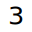
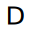
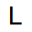
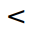

## cs

[🔊](../syllables.md#cs)

## cj

[🔊](../syllables.md#cj)

## j2

[🔊](../syllables.md#j2)

## sr

[🔊](../syllables.md#sr)

## sh

[🔊](../syllables.md#sh)

## j3

[🔊](../syllables.md#j3)

## st

[🔊](../syllables.md#st)

## sy

[🔊](../syllables.md#sy)

## co

[🔊](../syllables.md#co)

[meaning](../concepts/numbers.md#zero)

## j6

[🔊](../syllables.md#j6)

## sd

[🔊](../syllables.md#sd)

## cd

[🔊](../syllables.md#cd)

## se

[🔊](../syllables.md#se)

## rh

[🔊](../syllables.md#rh)

## fi

[🔊](../syllables.md#fi)

## j8

[🔊](../syllables.md#j8)

## 1l

[🔊](../syllables.md#1lcs)

[meaning](../concepts/numbers.md#one)

## 2l

[🔊](../syllables.md#2lcs)

[meaning](../concepts/numbers.md#two)

## 3l

[🔊](../syllables.md#3lcs)

[meaning](../concepts/numbers.md#three)

## j1

[🔊](../syllables.md#j1cs)

[meaning](../concepts/numbers.md#four)

## cl

[🔊](../syllables.md#clcs)

[meaning](../concepts/numbers.md#five)

## ad

[🔊](../syllables.md#adcs)

[meaning](../concepts/directions.md#center)

## tt

[🔊](../syllables.md#ttcs)

[meaning](../concepts/directions.md#up)

## ct

[🔊](../syllables.md#ctcs)

[meaning](../concepts/directions.md#down)

## uu

[🔊](../syllables.md#uucs)

[meaning](../concepts/directions.md#front)

## dd

[🔊](../syllables.md#ddcs)

[meaning](../concepts/directions.md#back)

## ll

[🔊](../syllables.md#llcs)

[meaning](../concepts/directions.md#left)

## rr

[🔊](../syllables.md#rrcs)

[meaning](../concepts/directions.md#right)

## cn

[🔊](../syllables.md#cncs)

[meaning](../concepts/numbers.md#six)

## cy

[🔊](../syllables.md#cycs)

[meaning](../concepts/numbers.md#seven)

## ua

[🔊](../syllables.md#uacs)

[meaning](../concepts/numbers.md#eight)

## 1x

[🔊](../syllables.md#1xcs)

[meaning](../concepts/numbers.md#nine)
