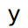
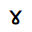
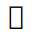

## cs

[🔊](../phonemes.md#cs)

## cj

[🔊](../phonemes.md#cj)

## j2

[🔊](../phonemes.md#j2)

## sr

[🔊](../phonemes.md#sr)

## sh

[🔊](../phonemes.md#sh)

## j3

[🔊](../phonemes.md#j3)

## st

[🔊](../phonemes.md#st)

## sy

[🔊](../phonemes.md#sy)

## co

[🔊](../phonemes.md#co)

## j6

[🔊](../phonemes.md#j6)

## sd

[🔊](../phonemes.md#sd)

## cd

[🔊](../phonemes.md#cd)

## se

[🔊](../phonemes.md#se)

## rh

[🔊](../phonemes.md#rh)

## fi

[🔊](../phonemes.md#fi)

## j8

[🔊](../phonemes.md#j8)

## 1l

[🔊](../phonemes.md#1l)

## 2l

[🔊](../phonemes.md#2l)

## 3l

[🔊](../phonemes.md#3l)

## j1

[🔊](../phonemes.md#j1)

## ad

[🔊](../phonemes.md#ad)

[meaning](../concepts/directions.md#center)

## tt

[🔊](../phonemes.md#tt)

[meaning](../concepts/directions.md#up)

## ct

[🔊](../phonemes.md#ct)

[meaning](../concepts/directions.md#down)

## uu

[🔊](../phonemes.md#uu)

[meaning](../concepts/directions.md#front)

## dd

[🔊](../phonemes.md#dd)

[meaning](../concepts/directions.md#back)

## ll

[🔊](../phonemes.md#ll)

[meaning](../concepts/directions.md#left)

## rr

[🔊](../phonemes.md#rr)

[meaning](../concepts/directions.md#right)

## cl

[🔊](../phonemes.md#cl)

## cn

[🔊](../phonemes.md#cn)

## ua

[🔊](../phonemes.md#ua)

## cy

[🔊](../phonemes.md#cy)

## 1x

[🔊](../phonemes.md#1x)
